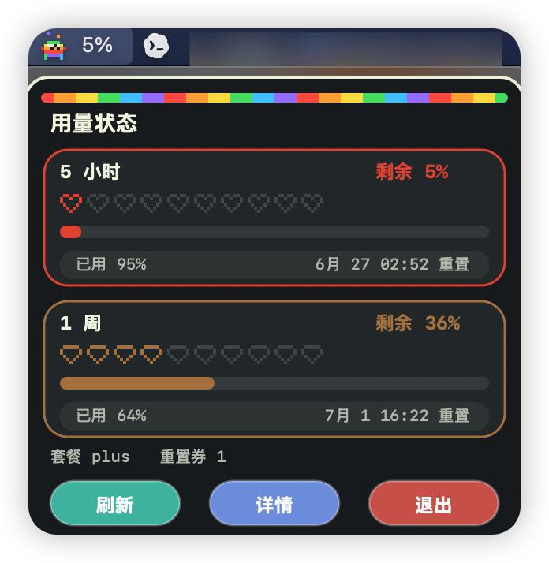
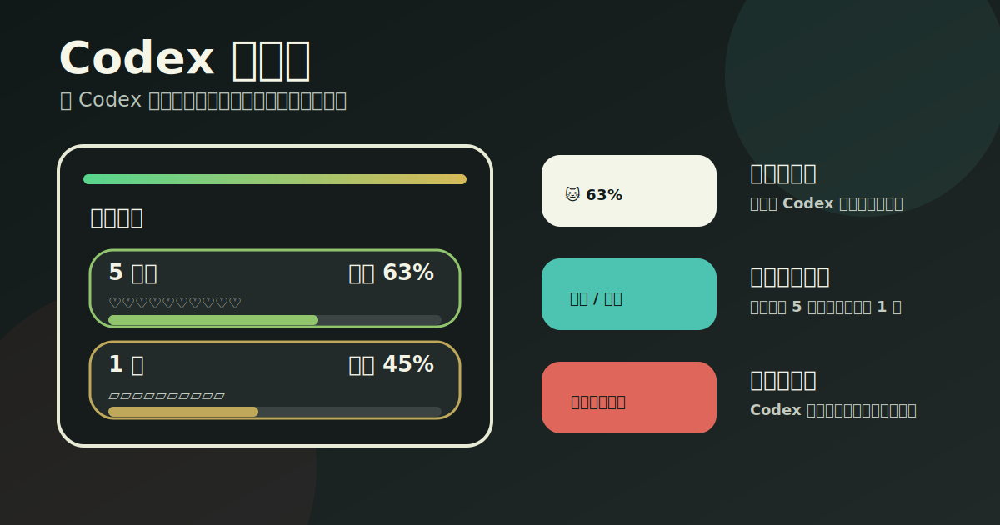
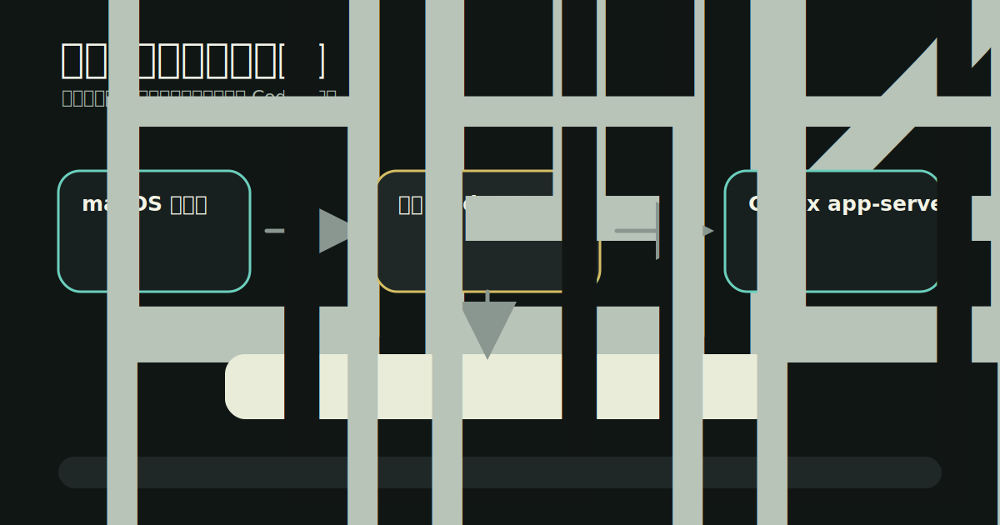
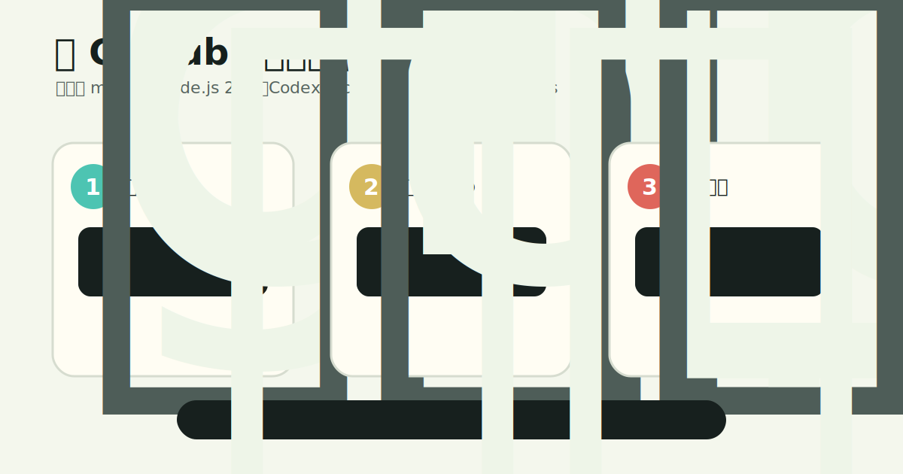

# Codex 健康值

一个 macOS 菜单栏小工具，用像素猫展示 Codex 的剩余用量。点击菜单栏图标可以看到 5 小时和 1 周用量窗口、重置时间、套餐和重置券信息。



## 总览



## 工作原理



## 功能

- 菜单栏实时显示 Codex 剩余用量百分比
- 像素风格详情卡片，5 小时用心形展示，1 周用盾牌展示
- 按剩余用量从绿色到红色变色
- Codex 有任务运行时，小猫会进入彩虹动画状态
- 任务结束时发出系统提醒
- 本地 Node 状态服务，数据只在本机读取

## 安装流程



## 环境要求

- macOS 13 或更高版本
- Node.js 22 或更高版本
- 已安装 Codex 桌面版或可用的 `codex` 命令
- Xcode Command Line Tools，用于编译菜单栏 app

## 本地运行网页状态页

```bash
npm start
```

打开：

```text
http://127.0.0.1:3333
```

## 构建 macOS 菜单栏 App

```bash
npm run build:macos
open macos/build/CodexUsageStatus.app
```

构建好的 app 位于：

```text
macos/build/CodexUsageStatus.app
```

如果要安装到应用程序目录：

```bash
cp -R macos/build/CodexUsageStatus.app /Applications/Codex健康值.app
open /Applications/Codex健康值.app
```

## 配置项

可以通过环境变量调整本地服务：

```bash
PORT=3334 npm start
CODEX_APP_SERVER_PORT=47892 npm start
REFRESH_MS=10000 npm start
CODEX_BIN=/Applications/Codex.app/Contents/Resources/codex npm start
CODEX_HOME="$HOME/.codex" npm start
```

## 登录时启动

打开 macOS 系统设置：

```text
系统设置 -> 通用 -> 登录项
```

把 `/Applications/Codex健康值.app` 添加进去即可。

## 注意

- 这个工具只访问本机的 Codex 状态，不需要外部服务器。
- 菜单栏 app 会在本地启动一个 Node 状态服务。
- 浏览器页面不能稳定地直接连接 Codex app-server，所以这里使用本地 Node 代理读取状态。
- 当前任务运行状态通过 Codex app-server 事件和本机 Codex state sqlite 轮询共同判断。

## License

MIT
